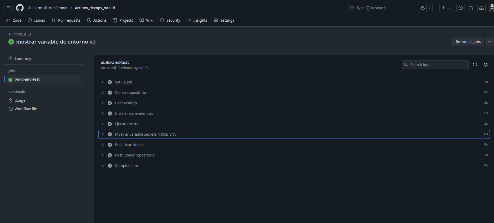

# Preguntas sobre GitHub Actions y Automatización de CI/CD

## Equipo 2

### Integrantes:

- **Francsico Leiva**
- **Guillermo Torres**

---

## ¿Qué ventajas observaste al automatizar pruebas con GitHub Actions?

- Integración nativa con GitHub: no requiere configuración adicional para enlazar el repositorio. Tampoco requiere de instalaciones previos o disposición de un servidor propio, dando la libertad de poder usar el sistema operativo que se requiera.
- Ejecución inmediata en cada push o pull request, lo que permite detectar errores de forma temprana.
- Soporte para múltiples entornos y matrices de prueba (por ejemplo, diferentes versiones de Node.js).

## ¿Qué diferencia a GitHub Actions de Jenkins u otras herramientas CI?

- GitHub Actions se ejecuta directamente desde GitHub, sin necesidad de servidores externos, mientras que Jenkins requiere instalación y mantenimiento.
- La configuración de GitHub Actions se realiza con archivos YAML directamente en el repositorio, lo que facilita el versionado.
- Tiene un marketplace con acciones reutilizables y una integración más directa con los eventos de GitHub (como issues, releases, etc.).
- No es un sistema on-premise

## ¿Qué mejoras podrías agregar a este pipeline?

- Agregar un paso de linting para asegurar la calidad del código.
- utilizar _sonarqube_ para ver agregar otra capa de comprobación de calidad de código y seguridad estática.
- Integrar otras herramientas de DevSecOps.
- Incluir pruebas unitarias con matrices para distintos entornos.
- dockerización del proyecto
- Añadir despliegue automático a entornos de staging o producción con validaciones condicionales.

## ¿Qué consideraciones de seguridad aplicarías en proyectos reales?

- No exponer secretos en los logs: usar `env:` y dejar que GitHub oculte los valores.
- Usar entornos de ejecución con permisos mínimos necesarios.
- Gestionar roles y permisos de ramas al igual que sus comprobaciones con actions asociados a cada una de ellas.
- utilizar _sonarqube_ para ver agregar otra capa de comprobación de calidad de código y seguridad estática.
- Integrar otras herramientas de DevSecOps.
- Validar el código de terceros (acciones externas) con hash o referenciando versiones fijas.

## Ideas para automatizar otros aspectos del proyecto:

1. **Build y test:** Automatizar la construcción de artefactos (como imágenes Docker) y ejecutar pruebas de extremo a extremo con Selenium o Cypress.
2. **Despliegue:** Crear un workflow que despliegue a staging o producción cuando se mergee a la rama `main`, con revisión manual opcional.
3. **Auditoría y calidad:** Integrar herramientas como SonarQube para análisis estático, y Dependabot para actualización automática de dependencias vulnerables.

---

## Comprobación de éxito en el action:

